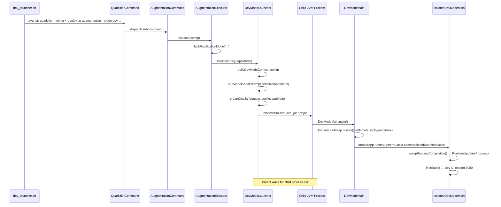
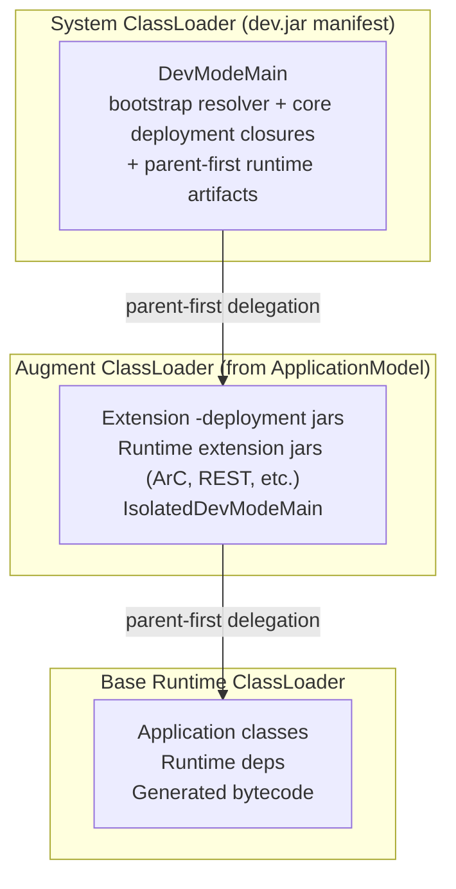

# Dev Mode & Dev UI Integration

Dev mode is the most complex part of `rules_quarkus` due to classloader isolation requirements. This document captures the key design decisions and troubleshooting knowledge.

## Overview

Dev mode launches Quarkus with the Dev UI, hot-reload, and Dev Services support. The core challenge is **classloader isolation**: the quarkifier deploy jar's classpath and the `ApplicationModel`'s deployment dependencies overlap, causing `LinkageError` and `VerifyError` if not handled carefully.

The solution follows Maven's `DevMojo` pattern: a **separate JVM process** is started with a minimal "dev jar" that contains only bootstrap classes. All deployment and runtime extension jars are loaded exclusively by the augment classloader from a serialized `ApplicationModel`.

## The Subprocess Approach

Unlike production augmentation (which runs in-process), dev mode uses a **separate JVM process**:

1. `AugmentationExecutor.execute()` detects `mode == DEV` and delegates to `DevModeLauncher.launch()`
2. `DevModeLauncher` serializes the `ApplicationModel` to a temp file
3. `DevModeLauncher` creates a minimal "dev jar" with a serialized `DevModeContext` and a precisely scoped manifest classpath
4. A child `java -jar dev.jar` process is started with `ProcessBuilder`
5. The child process runs `DevModeMain.main()` → `IsolatedDevModeMain` inside a clean augment classloader
6. The parent process waits for the child to exit, with a shutdown hook to destroy it on SIGTERM

## Launch Sequence



## The Dev Jar

`DevModeLauncher.createDevJar()` creates a temporary JAR containing:

1. **`META-INF/MANIFEST.MF`** — with `Main-Class: io.quarkus.deployment.dev.DevModeMain` and a `Class-Path` pointing to deployment infrastructure jars (as `file:///` URIs)
2. **Serialized `DevModeContext`** — at the entry path `DevModeMain.DEV_MODE_CONTEXT`, containing module info, source paths, and build system properties

### Manifest Classpath Strategy

The manifest classpath contains two categories of jars, matching Maven's `DevMojo`:

1. **Dev process infrastructure** — the transitive closures of `quarkus-bootstrap-gradle-resolver`, `quarkus-bootstrap-maven-resolver`, and `quarkus-core-deployment`, resolved separately via `@rules_quarkus//deployment:core`. This matches the roots in Quarkus Gradle's `QUARKUS_BOOTSTRAP_RESOLVER_CONFIGURATION`; the Maven plugin gets the Maven resolver from its own plugin classpath. For jars that also exist on the application classpath, the `@maven` version is preferred to avoid class identity conflicts between Coursier and `rules_jvm_external` copies.

2. **Parent-first runtime artifacts** — runtime jars flagged as `CLASSLOADER_PARENT_FIRST` in the `ApplicationModel` (logging, Jakarta APIs, etc.).

Everything else — extension deployment jars, runtime extension jars — is loaded by the augment classloader from the serialized `ApplicationModel`.

One jar of the infrastructure closure is not on the manifest classpath: `io.quarkus:quarkus-class-change-agent`, which the child JVM loads with `-javaagent` instead, as `DevMojo` and Gradle's `QuarkusDev` load it (see [Instrumentation-based reload](#instrumentation-based-reload)). A Java agent's jar is appended to the system class path by the JVM itself.

## Declared Build Properties

`quarkus_app` shares its `build_properties` map with the generated
`<name>_dev` target, which writes it to a `.build.properties` runfile and
passes `--build-properties-file` to the quarkifier. `BuildProperties.defaults`
merges it with the dev-lifecycle invariants (package type, main class, pinned
builder image), which win any key conflict, and `DevModeLauncher` then carries
the merged set over **two** channels:

1. **`-D` flags on the child JVM** — emitted first on the command line, before
   every launcher-owned flag. Later `-D` flags win for the same name, so
   `java.util.logging.manager` and the serialized application-model path stay
   launcher-owned and cannot be redirected by a declared property. This mirrors
   the ordering `e2e/smoke/launcher_precedence_test.bzl` pins for the test
   launcher.
2. **The serialized `DevModeContext`** — `context.getBuildSystemProperties()`,
   which Quarkus reads for SmallRye Config expression resolution during
   augmentation.

Both channels derive from `DevModeLauncher.devBuildProperties(config)` so they
cannot drift apart.

Unlike the packaged JVM lifecycle — where the properties are scoped around
augmentation and are gone once the packaged application runs — the dev `-D`
flags are ordinary system properties (ordinal 400) and stay visible to run-time
configuration for the whole dev session. A declared `quarkus.profile`,
therefore, also suppresses `%dev.*` entries in `application.properties` and
changes Dev Services behavior. Keep run-time configuration in
`application.properties` rather than in `build_properties`.

## Three Classpaths

The `quarkus_dev` rule manages three separate classpaths:

| Classpath | Source | Purpose |
|-----------|--------|---------|
| `application_classpath` | `deps` runtime jars | Runtime deps for the ApplicationModel |
| `deployment_classpath` | `@rules_quarkus//deployment:all` | All deployment jars for the ApplicationModel |
| `core_deployment_classpath` | `@rules_quarkus//deployment:core` | Bootstrap resolvers and core deployment infrastructure for the dev jar manifest |

The `@rules_quarkus//deployment` package resolves these in two Coursier phases:
1. `coursier fetch` both Quarkus bootstrap resolvers plus `quarkus-core-deployment` → `:core` target
2. `coursier fetch` all extension deployment GAVs → `:all` target (superset of `:core`, ~300 jars)

## Classloader Hierarchy



## Conditional Dev Dependencies

Quarkus extension descriptors can declare both ordinary conditional dependencies
and `conditional-dev-dependencies`. Repository setup retains the exact candidate
runtime/deployment graph. Model assembly applies a mode-aware fixpoint: DEV can
activate both kinds, NORMAL/TEST/NATIVE only activate ordinary conditionals,
dependency conditions use full artifact keys, and newly activated extensions
can trigger further candidates. Dev UI is therefore discovered through the
same generic descriptor graph as any other conditional extension; no hardcoded
`quarkus-devui`, `-dev`, or `-spi` list is used.

## Parent-First Artifacts

The explicit model adapter applies descriptor-driven parent-first,
runner-parent-first, and lesser-priority artifact keys using full GACT matching.
This makes the augment classloader delegate infrastructure jars to the system
classloader without artifact-ID heuristics.

Key categories: bootstrap (`quarkus-bootstrap-core`, `quarkus-bootstrap-maven-resolver`, etc.), core (`quarkus-core`, `quarkus-value-registry`), config (`smallrye-config-core`, `smallrye-config-common`, `microprofile-config-api`), logging (`jboss-logmanager`, `jboss-logging`), Jakarta APIs.

**Important**: `smallrye-config` itself is NOT parent-first. In SmallRye Config 3.13+, the main jar contains CDI beans (`ConfigProducer`) whose ArC-generated proxies cause `VerifyError` when the bean class and proxy are loaded by different classloaders.

## Known Quarkus Bootstrap Workarounds

### ApplicationModel Serialization Format

Quarkus 3.31+ changed `ApplicationModelSerializer` to use JSON format by default instead of Java Object Serialization. The `DevModeLauncher` uses a version-specific `AppModelSerializerStrategy`:
- **3.27.4**: `BootstrapUtils.serializeAppModel()` (Java Object Serialization)
- **3.33.2** and **3.39.4**: `ApplicationModelSerializer.serialize()` (JSON)

### Explicit metadata

Platform imports/properties, capabilities, and classloading keys are populated
from the validated v1 model and exact extension descriptors. The old empty
`PlatformImportsImpl`, artifact-ID runner-parent-first repair, and classpath
inference paths have been removed.

## Project Root

`DevModeContext`'s project directory — and with it the `target/` directory Quarkus
writes build metrics to — is the application module's own directory, not the
workspace root: the first declared source or resource directory with a `src/main`
ancestor, which is the application's module because `quarkus_app` takes its first
dep as the application and the rule emits directories in dep order. It falls back
to the workspace root when no declared directory follows the Maven layout, and to
the output directory when there is no workspace root (dev mode launched without
`bazel run`).

The module, rather than the workspace root, because an extension that needs the
project it is building for walks up from the build target directory looking for a
`src/main` marker. Web Bundler's project scanner does, and a workspace root has no
Maven layout, so the walk runs to the filesystem root and the scanner reports no
project — after which `WebDependenciesProcessor#installDependencies` produces
nothing and bundling fails on a null `InstalledWebDependenciesBuildItem`. The test
lifecycle avoids the whole question by fabricating a Maven-layout project directory
per action (`test_launcher.sh.tpl`), which dev mode cannot do: its project
directory is the tree the developer edits.

## Source Directory Flow

1. `collect_source_dir_paths()` in the Starlark rule finds `src/main/java` markers in dep source files
2. Source dirs are written to a runfiles file and passed via `--source-dirs`
3. `DevModeLauncher` sets them as `sourcePaths` in `DevModeContext.ModuleInfo`
4. `IsolatedDevModeMain` creates a `RuntimeUpdatesProcessor` that watches these directories

When source dirs, watch dirs, and code-generation input dirs are all empty,
hot-reload is disabled but the Dev UI still works. Declared code-generation inputs
keep the rebuild watcher active even when there are no Java source dirs.

### Two source lists, because two things watch

`--source-dirs` tells Quarkus what the module's sources are, and Quarkus compiles
what it finds under them with its own `CompilationProvider`. Under Bazel that is
a claim about ownership, not just a path list: a Scala root declared there makes
Quarkus compile Scala off the dev classpath, beside the Bazel action that already
owns that compile and against a classpath that is not the one the target was built
with. So the list stays Java-only, which is the one language whose in-process
compile agrees with what Bazel produced.

`--watch-dirs` is the rules' own list, read only by `BazelFileWatcher`, and it
covers every language in the graph (`_WATCH_MARKERS`, plus whatever `dev_watch_dirs`
names). A change under one of them rebuilds the dev target, and Bazel decides what
that means; Quarkus sees the result as changed classes in the mutable directory.
This is why the watcher matches on extension — `.java`, `.scala`, `.kt` — rather
than on the enclosing directory: a source root also holds resources and editor
droppings, and rebuilding on those would queue a build for every unrelated save.

### One resource root: the mutable directory

The module's declared resource paths are deliberately empty, and its resources output
path is the mutable classes directory.
`RuntimeUpdatesProcessor.checkForFileChange` reads declared resource paths when it has
them, copying changed files out of the source tree itself, and scans the classes
directory only when it has none. Declaring the workspace's resource directories would
therefore leave everything Bazel writes into the mutable directory unwatched, and an
extension that watches by classpath location would never see a rebuild — the Web
Bundler registers exactly such a watch over its web root.

The cost is that a resource edit is delivered by a rebuild rather than copied straight
out of the source tree, so it takes as long as one. `BazelFileWatcher` therefore
watches the declared resource directories too and rebuilds on a change below them.
The exchange is the same one the rest of dev mode makes here: what runs is what Bazel
built, rather than a source tree Quarkus copies from independently and which would
diverge until some later rebuild happened to agree.

### What the sync delivers

`ClassSyncer` carries the whole application payload into the mutable classes
directory, not only `.class` files. An application archive also holds the resources
Quarkus and its extensions read from the classpath, and an extension can watch those
by classpath location: the Web Bundler registers a
`HotDeploymentWatchedFileBuildItem` over everything under its web root, so a rebuilt
asset reaches the running application through exactly the path a rebuilt class does —
by restarting it (see project files below for the alternative). Only jar packaging metadata is dropped — a manifest or signature file
describes nothing in a class tree assembled from several jars.

Unchanged entries are not rewritten. The dev loop syncs thousands of files where a
rebuild changed a handful, and Quarkus decides what to reload from what changed on
disk; rewriting every file would make each reload look like a change to the whole
application.

An application that wants a different artifact in the dev loop than the one it
packages selects on `@rules_quarkus//quarkus:dev_lifecycle`, which is true
throughout the dev target's graph — a fast unoptimized link of a browser module in
place of the whole-program one, for instance.

### Project files: outputs the application reads from its project directory

A classpath change is not always the cheapest reload an extension offers. The Web
Bundler watches everything on the classpath under its web root with
`restartNeeded(true)`, so a rebuilt browser module delivered by the sync restarts the
application. The same file in the module's local web directory (`<module>/web`,
resolved against the project root) is something the bundler symlinks into its staging
directory and watches itself: a modification re-bundles and live-reloads the browser
without a restart, whereas an addition or removal still triggers a rescan and restart.

`dev_project_files` delivers outputs that way. It maps targets, built in the dev
configuration, to workspace directories:

```starlark
quarkus_app(
    name = "app",
    dev_project_files = {"//web/js:main_dev": "web/jvm/web/scalajs"},
    ...
)
```

`ProjectFileMirror` brings each directory in line with its outputs before the
application starts and again after every successful hot-reload rebuild, right after the
class sync.
The directory belongs to the session: after a mirror it holds exactly the files of its
outputs, and anything else in it is deleted, so it must be a directory of its own and
never one holding checked-in files. That exact mirroring is what makes a restarted
session correct: files a previous session left behind are gone after the first mirror.

The mirror decides what the application's watcher sees, so it writes deliberately:

- A changed file is truncated and rewritten through its existing inode. Quarkus's
  `WatchServiceFileSystemWatcher` reports a rename onto an existing file as an addition,
  so the write-to-temp-and-rename that is usually safer would turn every edit into a
  restart.
- A file whose content is unchanged is not touched, and an output whose modification
  time and size match the previous mirror is not even read. A browser module split into
  many small modules then reaches the bundler as modifications of only the modules the
  edit changed.
- Existing files are rewritten first, new files created next, and extraneous ones
  deleted last.

Symlinking the outputs into the directory does not work: the bundler watches the link,
and Bazel replacing the file behind it produces no event there. Changes the mirror
makes are also excluded from `BazelFileWatcher`, so a directory under a watched root
cannot make the mirror's writes trigger another build.

Because the prod build packages the same asset on the classpath, a rule usually
selects on `@rules_quarkus//quarkus:dev_lifecycle` to leave it out of the dev jar.
Otherwise both copies reach the bundler.

### Incremental Scala.js modules

A browser module written in Scala.js is the usual project file, and the usual cost of
a dev-loop edit is not the mirror but the build behind it: a full compile of the
module's target and a cold link of the whole program. `scala_js_dev_module`
(`@com_clementguillot_rules_quarkus//quarkus/scalajs:defs.bzl`) compiles the module
with zinc and links it with an incremental, unoptimized linker into one ES module
(`main.js` in the rule's output directory), keeping the state of both between builds:

```starlark
scala_js_dev_module(
    name = "main_dev",
    srcs = glob(["src/main/scala/**/*.scala"]),
    main_class = "my.app.Main",   # its no-argument `main` runs when the module loads
    deps = [":ui", "@maven//:org_scala_js_scalajs_library_2_13", ...],
    scalacopts = [...],
)
```

- **The state directory is the contract.** Zinc's analysis, the class, TASTy and IR
  files it produced, and the sources extracted from source jars live in
  `<name>.state` beside the output. Any process reads them, so the action is correct
  run fresh every time; a change of compiler or bridge wipes them. The action is
  `no-sandbox` and `no-remote`, since the directory is local by nature.
- **Worker mode is an optimization.** With `--strategy=ScalaJSDevModule=worker`, one
  resident process also keeps the compiler's class loaders and the linker's IR cache
  warm, so dependency jars are not re-read after the first build.
- **Failed compiles keep the last good state.** The class-file manager is
  transactional, and Scala.js IR and TASTy are managed as class files, so a compile
  error restores the previous products and a deleted class takes its IR with it.
- **The toolchain is the consumer's.** Register a `toolchain()` of type
  `@com_clementguillot_rules_quarkus//quarkus/scalajs:toolchain_type` wrapping a
  `scala_js_dev_toolchain` that names the compiler bridge
  (`org.scala-lang:scala3-sbt-bridge` at the compiler's version, whose closure is the
  compiler), zinc (`org.scala-sbt:zinc_2.13`), and the Scala.js linker and logging
  jars at a version no older than the Scala.js libraries being linked. The tool is
  compiled against zinc 1.12 and the linker's public API, and reaches the linker
  reflectively (its `org.scalajs.linker.interface` package has a name Java source
  cannot spell).

Point `dev_project_files` at the target to mirror its `main.js` into the local web
directory; an edit then costs the zinc increment plus an incremental link, and the page
re-bundles without a restart.

### Generated sources

Code generation always runs through Bazel before the initial dev startup.
The launcher watches the declared generator input directories and rebuilds the
`<name>_dev` target before syncing classes, which keeps regeneration sandboxed
and cacheable.

Dev mode regenerates under its own lifecycle: `deps` are configured through
`dev_lifecycle_transition`, so `quarkus_codegen` runs with launch mode
`DEVELOPMENT` and a `dev` application model, whereas `bazel build //:app` and
`bazel test` use `NORMAL` / `TEST`. Providers whose output depends on the launch
mode or config profile can therefore emit different sources in dev than in a
production or test build — worth checking first when a bug reproduces only under
`bazel run //:app_dev`. That transition is also why the watcher always rebuilds
the dev target itself rather than its deps: a dep built directly from the command
line would land in the baseline output tree, and hot-reload would sync stale
classes.

Because the transition changes a build setting, the dev dependency graph gets
its own configuration. `bazel cquery 'deps(//:app_dev) intersect //:lib'` and
the same query against `//:app` report different configuration hashes, so a
`bazel build //...` that requests both compiles every shared dependency twice.
That is the cost of making code generation launch-mode aware; build only
`//:app` (or only `//:app_dev`) when the extra configuration is not wanted.

### Hot-Reload Build Configuration

On a source change, `BazelFileWatcher` runs `bazel build <targets>` (binary resolved by
the launcher: `bazel` from `PATH`, falling back to `bazelisk`; overridable via
`--bazel-command`). The class output paths it syncs from were recorded **at analysis
time**, in the configuration used to build the dev target — so if you launch dev mode
with configuration-affecting flags (`--config`, `-c opt`, `--define`, ...), the
hot-reload build must use the same flags or its outputs land in a different
`bazel-out/<config>` tree and the sync picks up stale files. Pass them via
`dev_build_args`:

```starlark
quarkus_app(
    name = "app",
    dev_build_args = ["--config=dev"],
    ...
)
```

Then run `bazel run --config=dev //pkg:app_dev`. The watcher warns once per session
when a successful rebuild updates none of the recorded class outputs — the telltale
sign of a configuration mismatch. The rebuild timeout defaults to 600 s
(`--bazel-build-timeout-seconds`); on timeout or build failure, the tail of
`bazel-hot-reload.log` is echoed to the console.

### Instrumentation-based reload

With `quarkus.live-reload.instrumentation=true`, Quarkus applies a change that only
touches method bodies by redefining the changed classes in the running JVM instead of
restarting the application: no re-augmentation, no restart of the application's beans,
and no dropped browser live-reload connection. `RuntimeUpdatesProcessor` attempts this
only when `ClassChangeAgent.getInstrumentation()` is set, which is the case only when
the JVM was started with `quarkus-class-change-agent` as a Java agent: its `premain`
stores the JVM's `Instrumentation` there.

The agent is part of `quarkus-core-deployment`'s closure, so it is among the jars of
`@rules_quarkus//deployment:core`. `DevModeLauncher` finds it there by its Maven
coordinates (from the jar's `pom.properties`, since the generated repository's file name
carries no groupId) and passes it as `-javaagent`, leaving it off the dev jar's
`Class-Path`. `quarkus-core` declares the agent a parent-first artifact, so the augment
classloader resolves `ClassChangeAgent` from the system class loader, where the agent
registered it, rather than loading a second, empty copy.

What counts as a body-only change is Quarkus's decision, made on the class files a
rebuild syncs: added or removed methods, fields or annotations still restart the
application. For Scala sources this is narrower than it looks, because a lambda or an
`inline` expansion becomes a synthetic method of the enclosing class, so adding one is
a structural change.

A successful redefinition logs `Application restart not required, replacing classes via
instrumentation`; with the property off, or without the agent, the same change restarts
the application.

## Known Limitations

- **Dependencies graph direct links**: The Dev UI "Application Dependencies" graph shows all runtime extensions as direct deps of the root node (instead of only user-declared ones like Maven does), because Bazel's flat classpath doesn't distinguish user-declared from transitive extensions ([#51](https://github.com/clementguillot/rules_quarkus/issues/51)).
- **Extensions panel**: The Dev UI Extensions panel doesn't work — it uses Maven resolver classes unavailable in Bazel (produces `ClassCastException` for `RemoteRepository` across classloaders).
- **No in-process dev mode**: Always uses a separate JVM process (~2-3s startup overhead).
- **Docker required for Dev Services**: Dev Services need Docker on the host.

## Dev UI Static Resources

The Dev UI serves static resources (Vaadin web components, flag-icons, etc.) from jars in the deployment classpath. These jars contain resources under `META-INF/resources/_static/`. The `BuildTimeContentProcessor.extractJsVersionsFor()` method parses the version from the jar URL path by finding the artifact name and taking the next path segment.

For this to work correctly, the `@rules_quarkus//deployment` package preserves the Maven directory structure in its symlinks (e.g., `jars/org/mvnpm/flag-icons/7.5.0/flag-icons-7.5.0.jar`). A flat `jars/filename.jar` layout would cause the version extraction to include `.jar` in the version string, producing broken URLs like `/q/_static/flag-icons/7.5.0.jar/...`.

## Troubleshooting

### LinkageError or VerifyError on startup

Check for duplicate jars across classloaders. Common causes:
- A jar exists in both `@maven` (processed) and Coursier cache (original) with different file identities
- A jar containing CDI beans is marked as parent-first (loaded by system CL, proxy generated in runtime CL)
- An extension-specific deployment jar leaked into the core deployment classpath

### Silent exit with no error

`abortOnFailedStart` may not be set to `true`. Check `DevModeLauncher.buildDevModeContext()`.

### Hot-reload not working

Check that `_collect_java_source_dirs()` finds your source roots, the source dirs file is non-empty in runfiles, and `--source-dirs` appears in the quarkifier CLI invocation.
